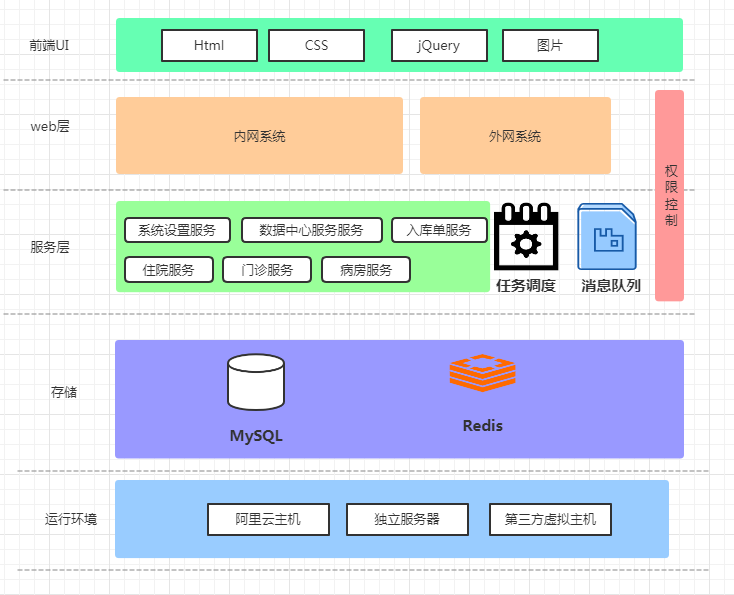

# hospital-dubbo

医院项目，可以用来练手的项目，需要的自行git clone ，动动你那发财的小手点个**star.**

## 整体架构

先画一个整个架构，后期可能会有所调整，但是大方向不变，更多的是添加一些东西进去。

## 项目结构介绍

父项目：hospital-dubbo

子项目：

- hospital-admin：医院内人员使用 （集成了thymeleaf）
- hospital-web：病人外网预约挂号（集成了thymeleaf）
- hospital-outpatient：门诊部（dubbo服务）
- hospital-inpatient：住院部（dubbo服务）
- hospital-warehouse：仓库管理（dubbo服务）
- hospital-house：病房（dubbo服务）
- hospital-system：系统设置（dubbo服务）
- hospital-job：定时任务 
- hospital-mq：消息队列消费者处理（dubbo服务）
- hospital-in-order：入库单（dubbo服务）
- hospital-common：公共

项目结构暂定这样，后期可能会有所调整，但是整体就是

> **web项目+dubbo服务+定时任务+消息队列**

这种方式。

## 技术栈

目前项目用到的技术栈如下：

- Spring Boot
- MyBatis
- MySQL
- Redis
- RabbitMQ
- Dubbo
- Nacos

后期计划把分布式事务框架Seata集成进来，做分布式事务处理。

## 业务功能

做一个业务功能简单介绍：

### 病人

场景1：病人去医院窗口挂号，然后去对应科室医生做检查，要么是开药，要目是做项目检查。

场景2：病人在网上预约挂号，预约成功后通过支付宝支付挂号费用，支付完成后，根据自己预约时间去一样做检查。

### 医生

根据病人挂号，对病人进行检查

### 发药师

1：根据医生给病人开的单子，加上支付结算单子，给病人发药。

2：添加入库单，入库药品信息

### 挂号人员

挂号工作人员，根据用户身份证号进行挂号，收取挂号费，发挂号单子。

### 领导

对医院工作人员进行排班

### 管理员

对系统各种设置，角色创建，赋权限等非医院业务操作。

